# SyncTool · 数据库实时同步工具

**简体中文** | [English](README_EN.md)

[](LICENSE)
[](https://openjdk.org/)
[](https://spring.io/projects/spring-boot)

在**异构数据库**之间实时同步**结构与数据**的开箱即用 Web 应用。单个 jar 启动，浏览器点几下即可让 Oracle 的表持续流向 PostgreSQL、让 MySQL 的增量实时落到达梦 —— 不需要 Kafka、不需要 ZooKeeper、不需要写一行代码。

- 项目地址：<https://github.com/vfaner/synctool>
- 国内镜像：<https://gitee.com/super_rgh/synctool>
- 视频演示：<https://www.bilibili.com/video/BV1iHYJ6vEEd>（10 分钟，从建连接到实时同步）

技术栈：Spring Boot 2.7 单体架构 + Thymeleaf 服务端渲染 + Quartz 调度 + H2 内嵌元数据库。**零外部依赖，内网离线可用。**

---

## 目录

- [效果截图](#效果截图)
- [核心功能](#核心功能)
- [与市面已有工具的对比](#与市面已有工具的对比)
- [支持的数据库](#支持的数据库)
- [部署步骤](#部署步骤)
- [登录与权限](#登录与权限)
- [使用流程](#使用流程)
- [并发与一致性设计](#并发与一致性设计)
- [增量检测策略](#增量检测策略)
- [配置项](#配置项)
- [AI 辅助转换（可选）](#ai-辅助转换可选)
- [架构](#架构)
- [测试](#测试)
- [已知限制](#已知限制)
- [许可证](#许可证)

---

## 效果截图

### 登录：先过一道口令

用户名 + 密码，右上角可随时切换主题与语言。默认口令没改之前，登录后每个页面顶部都会挂一条红色警告 —— 可以临时关掉，但浏览器一关又会回来，直到口令真的改了。

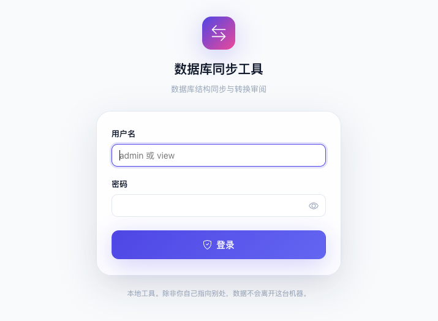

### 看板：全局同步态势一屏掌握

项目数、连接数、同步表数、24 小时变更量与最近活动流。

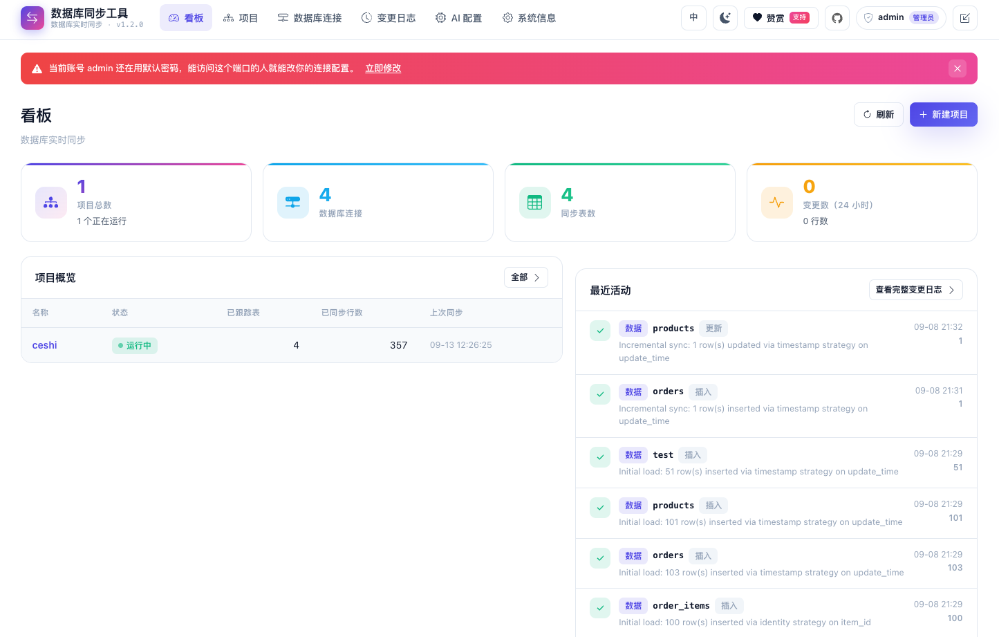

### 暗色主题：整套配色一起换

右上角一键切换。看板、卡片、表格、图标都跟着走，不是只把背景刷黑、留下一片刺眼的浅色控件。

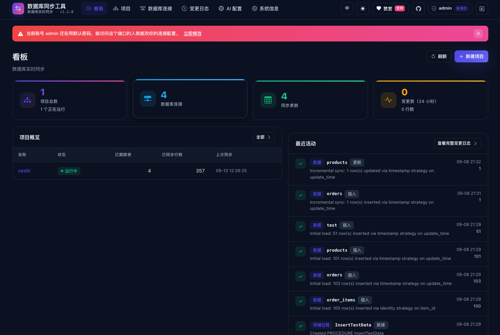

### 数据库连接：保存前先测通

选择数据库类型后自动生成 JDBC URL，可预览、可测试；非内置驱动填写 jar 路径即可动态加载。

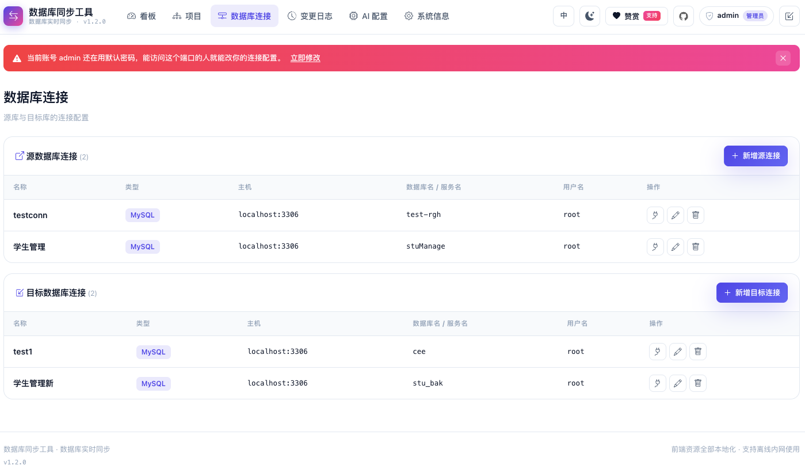

### 新增连接：类型选好，URL 自己拼

填主机、端口、库名，JDBC URL 当场生成，不用记各家数据库的连接串格式。密码加密后入库，测试连接通过再保存。

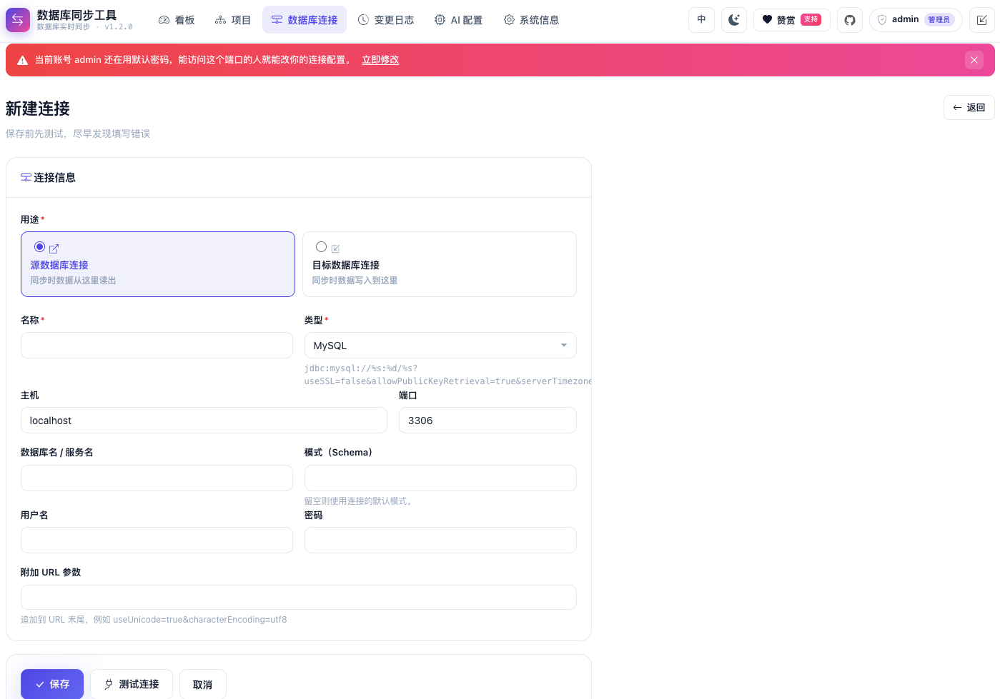

### 项目列表：多任务并行，启停自如

每个项目一组「源库 → 目标库」，独立启动/暂停，状态与最近同步时间一目了然。

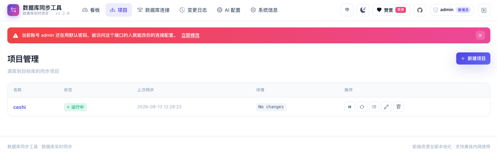

### 项目详情：逐表勾选与游标策略可视化

表 / 视图 / 存储过程分组勾选，支持搜索与批量操作；每张表的增量检测策略直接标注，`IDENTITY` 与 `NONE` 会显著提示（意味着更新可能同步不到）。

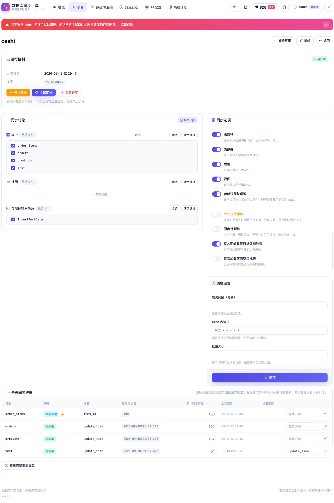

### 只读账号：看得到，改不了

同一个项目详情页，换成只有查询权限的 `view` 用户来看：表、视图与游标策略照常可见，但写入相关的操作不对它开放。上面其余截图都是 `admin` 用户下的。

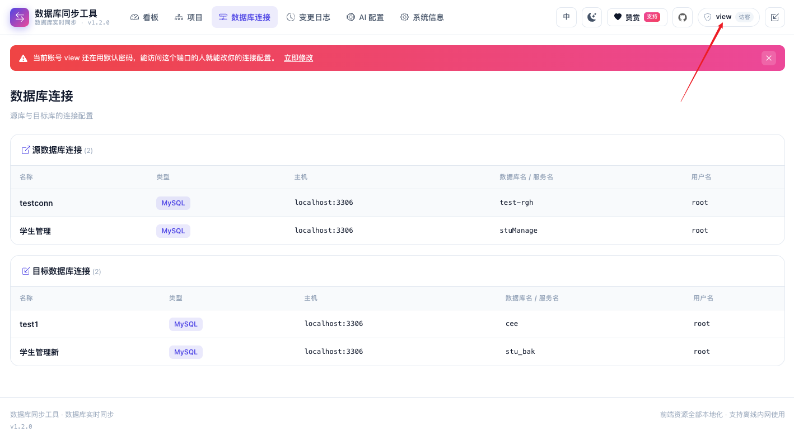

### 变更日志：每一次变更都可追溯

对象名、变更类型、影响行数、耗时与完整错误详情。

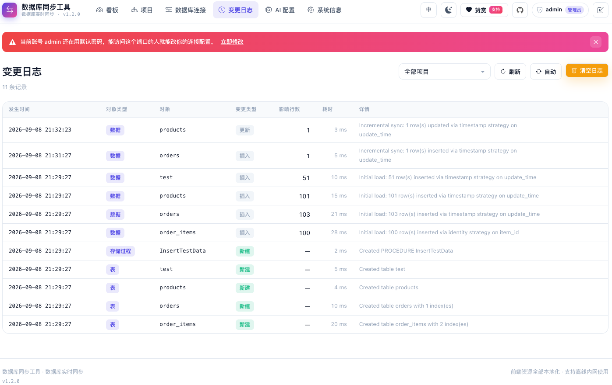

### AI 配置：多供应商共存，同一时刻只启用一个

启用另一个会自动把当前的关掉。列表直接标出协议、模型与上次探测结果，页面本身不会重新发起请求。

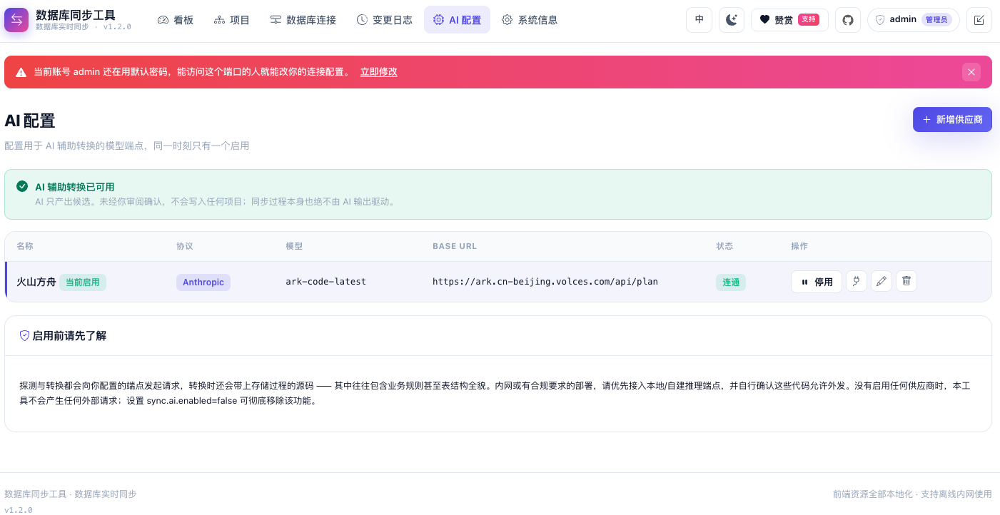

### 新增供应商：保存前先探测端点

密钥与数据库密码同样加密存储；探测会发一次真实请求，而非 TCP 探活 —— 密钥错误、模型名写错、Base URL 差一段路径这三类问题只有真发请求才暴露得出来。

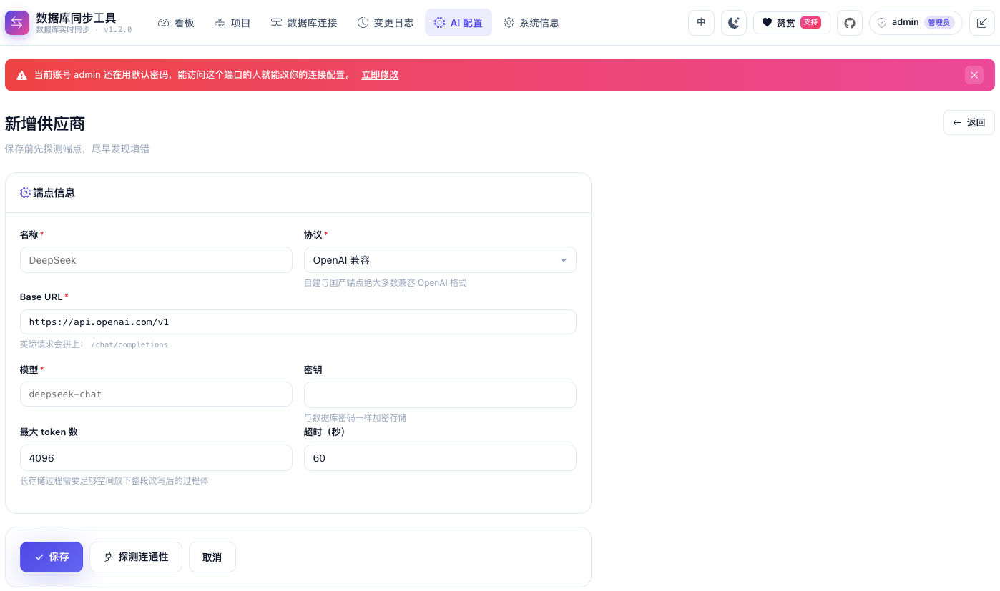

---

## 核心功能

| 分类 | 能力 |
|---|---|
| **项目管理** | 配置源库/目标库，多项目并行互不干扰 |
| **连接测试** | 保存前即可验证连通性，支持预览自动拼装的 JDBC URL |
| **对象选择** | 表 / 视图 / 存储过程，默认全选，支持搜索与批量勾选 |
| **同步内容** | 表结构、表数据、索引、视图、存储过程与函数 |
| **自动建对象** | 目标库不存在时按目标方言自动创建 |
| **SQL 方言适配** | 类型映射、函数名转换、标识符引号、分页语法、存储过程包装 |
| **实时同步** | 轮询检测（默认 2 秒），也可用 Cron 表达式精确编排 |
| **故障恢复** | 进程重启后从上次游标继续，停机期间的变更会被补齐 |
| **启停控制** | 随时启动/暂停，支持手动「立即同步」 |
| **变更记录** | 每次变更的对象、类型、行数、耗时与错误详情 |
| **看板** | 项目数、连接数、同步表数、24 小时变更量与最近活动 |
| **国际化** | 中 / 英文切换，默认语言按浏览器时区智能推断 |
| **主题** | 昼夜模式切换，未手动选择时跟随系统 |
| **全本地化前端** | 无 CDN、无 webfont、运行时零外部请求，内网离线可用 |

### 前端设计

蓝紫渐变主色（`#4f46e5` → `#ec4899`）、柔和阴影、玻璃拟态导航栏。样式为手写 CSS + 设计令牌（CSS 变量），**无框架、无构建步骤**。

**主题切换**

- 主题写在 `<html data-theme="dark|light">`，只覆盖 CSS 变量，因此组件无需第二套深色规则
- 存储键 `synctool-theme`（localStorage）
- **未手动选择过时跟随系统** `prefers-color-scheme`，并监听系统主题变化实时跟随；用户点过切换按钮之后就以用户选择为准，不再被系统覆盖
- `<head>` 内联脚本在首屏渲染前应用主题，避免深色用户看到一帧白底闪烁

**默认语言判定**（优先级从高到低）

| 优先级 | 来源 | 说明 |
|---|---|---|
| 1 | 语言 Cookie | 用户点过语言按钮，显式选择最高优先 |
| 2 | **浏览器时区** | `Asia/Shanghai`、`Asia/Hong_Kong`、`Asia/Taipei`、`Asia/Macau` 等 → 中文，其余 → 英文 |
| 3 | `Accept-Language` | 时区尚未上报时（首个请求）的兜底 |
| 4 | 简体中文 | 最终默认值 |

**为什么时区优先于 `Accept-Language`**：境外华人用户的浏览器语言常常是英文，但人在国内时区。时区是「想看哪种语言」更准的信号。

由于本项目是服务端渲染，语言必须在渲染前定好，所以时区由前端脚本探测后写入 `SYNCTOOL_TZ` cookie，服务端 `TimezoneAwareLocaleResolver` 读取它决定 Locale。首次访问若渲染语言与时区推断不符会自动刷新一次；用户显式选过语言后不再刷新。

**离线／内网可用** —— 所有前端资源均在仓库内，运行时不发起任何外部请求：

| 资源 | 说明 |
|---|---|
| `css/app.css` | 手写样式，含设计令牌与深色主题 |
| `js/theme.js` `js/app.js` | 原生 JS，无 jQuery、无框架 |
| `vendor/css/bootstrap-icons.min.css` + `vendor/fonts/*.woff2` | 图标字体，本地托管 |
| `vendor/favicon.svg` | 内联渐变 SVG |

字体使用系统字体栈（`PingFang SC` / `Microsoft YaHei` 等），**不引入 webfont**；下拉箭头等小图形使用内联 `data:` URI。静态资源总体积约 440KB。验证方式：抓取任意页面 HTML，其中 `src`/`href` 引用的外部 `http(s)` 地址数量为 **0**。

---

## 与市面已有工具的对比

### 一览表

| 维度 | **SyncTool** | Debezium + Kafka | Canal | Flink CDC | DataX | Kettle | SymmetricDS | Navicat/DBEaver 数据传输 |
|---|---|---|---|---|---|---|---|---|
| **部署形态** | **单个 jar** | Kafka + Connect + ZK/KRaft | Canal Server (+MQ) | Flink 集群 (JM/TM) | 客户端脚本 | 桌面 + 资源库 | 每节点部署引擎 | 桌面客户端 |
| **外部依赖** | **无** | Kafka、ZooKeeper | ZooKeeper（集群） | Flink、Checkpoint 存储 | 无（但需 JSON 作业） | JVM + 插件 | 数据库触发器 | 无 |
| **配置方式** | **Web 界面点选** | YAML/REST + 代码消费 | 配置文件 + 客户端代码 | SQL/DataStream 代码 | JSON 作业文件 | 图形化 ETL 拖拽 | properties + 建触发器 | 向导 |
| **持续增量同步** | ✅ 轮询/Cron | ✅ 日志级 | ✅ binlog | ✅ 日志级 | ❌ 一次性批量 | ⚠️ 需自建定时与增量逻辑 | ✅ 触发器 | ❌ 一次性 |
| **结构（DDL）同步** | ✅ **自动建表/索引/视图/存储过程** | ⚠️ 输出 DDL 事件，落库需自写 | ⚠️ 仅事件 | ⚠️ 需自定义 | ❌ 需预建表 | ⚠️ 手工映射 | ⚠️ 有限 | ✅ 但仅一次性 |
| **异构方言转换** | ✅ 类型/函数/引号/分页/过程 | ❌ 需自行实现 | ❌ | ⚠️ 部分 | ⚠️ 类型映射有限 | ⚠️ 手工 | ⚠️ 有限 | ⚠️ 一次性映射 |
| **国产数据库** | ✅ **达梦/金仓/GBase/神通/OpenGauss** | ❌ 基本不支持 | ❌ 仅 MySQL | ⚠️ 少数 | ⚠️ 需自写插件 | ⚠️ 靠通用 JDBC | ⚠️ 有限 | ⚠️ 部分 |
| **源库侵入性** | **只读查询，零侵入** | 需开 binlog/wal + 复制权限 | 需开 binlog | 需开 binlog/wal | 只读 | 只读 | **需建触发器** | 只读 |
| **幂等 / 断点续传** | ✅ 主键 upsert + 游标持久化 | ✅ offset | ✅ | ✅ checkpoint | ❌ | ❌ 需自建 | ✅ | ❌ |
| **可视化监控** | ✅ 看板 + 变更日志 | 需接 Prometheus/Grafana | 需自建 | Flink UI（偏作业） | 日志 | 有限 | 有 Web 控制台 | ❌ |
| **上手成本** | **分钟级** | 高 | 中高 | 高 | 中 | 中 | 中高 | 低（但不解决持续同步） |
| **内网离线** | ✅ 无外网请求 | ✅ | ✅ | ✅ | ✅ | ✅ | ✅ | ✅ |
| **适用规模** | 中小规模、部门级、信创迁移 | 大规模流式 | MySQL 生态 | 大规模流式 | 大批量离线 | 复杂 ETL | 多主复制 | 临时搬数 |

> 图例：✅ 原生支持　⚠️ 部分支持/需额外工作　❌ 不支持

### 五个真正的差异点

**1. 「一个 jar」对「一套基础设施」**

Debezium / Flink CDC 是优秀的流式框架，但要跑起来一条 MySQL → PostgreSQL 的链路，你需要 Kafka、Kafka Connect、协调服务，再写一个消费端把事件翻译成目标库的 DML。SyncTool 的等价操作是：`java -jar synctool.jar`，打开浏览器，建两个连接，建一个项目，点「启动同步」。**当同步需求的规模配不上一套流式基础设施的运维成本时，这个差距就是决定性的。**

**2. 结构同步是一等公民，不是留给你的作业**

绝大多数 CDC 工具只解决「数据流」，目标表得你自己先建好；DataX 更是明确要求预建表。SyncTool 会读取源库元数据，按**目标库方言**自动创建表、索引、视图、存储过程，并在源库 DDL 变更后把差异传播过去。跨异构库迁移里，建表和类型映射的工作量往往比搬数据本身更大。

**3. 为国产数据库与信创迁移而生**

达梦、人大金仓、南大通用、神通、OpenGauss 是内置的一等选项 —— 不是「通过通用 JDBC 也许能连上」，而是各自有专门的方言实现：`MERGE INTO ... FROM DUAL` 的 upsert 写法、类型上限（Oracle VARCHAR2 4000）、函数名差异、标识符引号规则都已处理。Oracle/SQL Server → 国产库的替换场景是本工具的主战场，而这恰恰是 Debezium、Canal 生态最薄弱的地方。

**4. 零侵入源库**

SymmetricDS 需要在源库建触发器；Debezium / Canal / Flink CDC 需要开启 binlog / WAL 逻辑复制并申请复制权限 —— 在很多生产库上，这是一次要走审批流程的变更。SyncTool 只需要一个**只读账号**，通过查询游标列做增量，源库结构和配置一动不动。

**5. 一次性搬数 vs 持续同步**

Navicat / DBeaver 的「数据传输」和 DataX 解决的是「把数据搬过去一次」。SyncTool 解决的是「让两边持续保持一致」：进程重启后从游标继续、停机期间的变更会被补齐、每一行写入都是幂等的。这是两个完全不同的问题。

### 什么时候**不**该用 SyncTool

诚实地讲清边界：

- **需要毫秒级延迟或严格的变更顺序** → 用 Debezium / Flink CDC。轮询方案的延迟下限就是轮询间隔。
- **需要捕获物理删除且表很大** → 无源库审计表时，删除检测要比对双方主键全集，仅对行数低于 `full-compare-max-rows` 的表启用。
- **单表数亿行的一次性初始化** → DataX 这类专为批量吞吐设计的工具更快。
- **需要复杂 ETL 变换（清洗、聚合、多流 join）** → 用 Kettle / Flink。SyncTool 做的是**同步**，不是**转换**。
- **多主双向复制** → 用 SymmetricDS。本工具假定目标库仅由自己写入。

---

## 支持的数据库

MySQL、MariaDB、Oracle、SQL Server、DB2、PostgreSQL、OpenGauss、**达梦 (DM)**、**人大金仓 (KingBase)**、**南大通用 (GBase)**、**神通 (Oscar)**、H2，以及**自定义数据库**（提供 JDBC URL、驱动类名与驱动 jar 路径，运行时动态加载）。

内置驱动仅 **MySQL / PostgreSQL / H2**；其余数据库需在连接配置中填写驱动 jar 路径，工具会用独立 `URLClassLoader` 加载并通过 `DriverShim` 注册到 `DriverManager`。这样做的好处是：**发行包不必捆绑一堆商业驱动，也不会因为驱动版本冲突污染应用类加载器。**

---

## 部署步骤

### 环境要求

| 项 | 要求 |
|---|---|
| JDK | **17 或以上** |
| Maven | 3.6+（仅构建时需要） |
| 内存 | 建议 ≥ 512MB 堆 |
| 端口 | 默认 `8080` |
| 磁盘 | 元数据库 + 日志 + 快照，建议预留 1GB |

### 一、构建

```bash
git clone https://github.com/vfaner/synctool.git
# 国内网络请使用镜像：
# git clone https://gitee.com/super_rgh/synctool.git

cd synctool
mvn clean package -DskipTests
```

产物：`target/synctool.jar`（可执行 fat jar）。

### 二、启动

```bash
java -jar target/synctool.jar
```

访问 <http://localhost:8080> 即可。

首次启动会在**当前工作目录**下自动创建：

| 目录 | 内容 |
|---|---|
| `./data` | 工具自身的元数据（H2 文件库：连接、项目、游标、锁、变更日志） |
| `./logs` | 运行日志 |
| `./snapshots` | 元数据快照目录（可通过 `sync.snapshot-dir` 修改） |

> ⚠️ 这些是**相对路径**。请固定在同一目录下启动，或用绝对路径覆盖配置，否则重启后会找不到原有数据。

### 三、生产环境配置（重要）

在 jar 同级目录创建 `application.yml`：

```yaml
server:
  port: 8080

spring:
  datasource:
    url: jdbc:h2:file:/opt/synctool/data/synctool;MODE=MySQL;AUTO_SERVER=TRUE

sync:
  poll-interval: 2000              # 轮询间隔（毫秒）
  snapshot-dir: /opt/synctool/snapshots
  batch-size: 500
  fetch-size: 1000
  safety-lag-ms: 1000
  row-count-audit-interval-ms: 60000
  full-compare-max-rows: 20000
  lock-ttl-ms: 300000
  crypto-password: 请改成你自己的强口令      # ← 必须修改
  crypto-salt: 请改成你自己的16位十六进制盐   # ← 必须修改

logging:
  file:
    path: /opt/synctool/logs
```

启动时指定：

```bash
java -jar synctool.jar --spring.config.location=file:./application.yml
```

> 🔐 **安全提示**：`sync.crypto-password` 与 `sync.crypto-salt` 用于加密存储的数据库连接密码，**发行包带有默认值，生产环境必须修改**。修改后已存储的旧密码将无法解密，需在界面上重新填写。`crypto-salt` 必须是合法的十六进制字符串。

### 四、加载非内置驱动

对于 Oracle、SQL Server、DB2、达梦、金仓等，把厂商驱动 jar 放到服务器上，例如：

```bash
mkdir -p /opt/synctool/drivers
cp ojdbc8.jar DmJdbcDriver18.jar kingbase8-8.6.0.jar /opt/synctool/drivers/
```

然后在「数据库连接」页面新建连接时，填写**驱动 jar 路径**（如 `/opt/synctool/drivers/ojdbc8.jar`）与**驱动类名**（选择预设类型时会自动填好）。点击「测试连接」验证加载成功即可保存。

### 五、后台常驻

**方式 A：systemd（推荐）**

`/etc/systemd/system/synctool.service`：

```ini
[Unit]
Description=SyncTool Database Sync
After=network.target

[Service]
Type=simple
User=synctool
WorkingDirectory=/opt/synctool
ExecStart=/usr/bin/java -Xms512m -Xmx1g -jar /opt/synctool/synctool.jar \
  --spring.config.location=file:/opt/synctool/application.yml
Restart=always
RestartSec=10

[Install]
WantedBy=multi-user.target
```

```bash
sudo systemctl daemon-reload
sudo systemctl enable --now synctool
sudo systemctl status synctool
```

**方式 B：nohup（快速验证）**

```bash
cd /opt/synctool
nohup java -jar synctool.jar > /dev/null 2>&1 &
```

### 六、升级

```bash
sudo systemctl stop synctool
cp target/synctool.jar /opt/synctool/synctool.jar
sudo systemctl start synctool
```

元数据库使用 `ddl-auto: update`，表结构会自动演进。**升级前请备份 `./data` 目录。** 停机期间源库产生的变更会在重启后由游标机制自动补齐，不会丢失。

---

## 登录与权限

所有页面和接口都必须登录后才能访问，没有任何匿名可达的入口。

首次启动会在元数据库的 `app_user` 表中自动创建两个账号（表已有数据则跳过，不会重置任何人的密码）：

| 用户名 | 角色 | 初始密码 | 权限 |
|---|---|---|---|
| `admin` | 管理员 | `123456` | 全部操作 |
| `view` | 访客 | `123456` | 只读 |

> ⚠️ **请在第一次登录后立刻改掉这两个密码。** jar 是公开可下载的，初始密码不是秘密。仍在使用初始密码的账号，登录后页面顶部会一直显示一条黄色警告横幅，点击即可跳到改密页。

### 两个角色的差别

权限不是按页面枚举的，而是**按 HTTP 方法**判定：本工具所有的写操作都是 POST，没有任何 GET 会改动状态，所以规则只有一条 —— **POST 一律要求管理员**。这样以后新增接口不会漏配。

- **管理员**：新建/编辑/删除数据库连接、项目、AI 供应商；勾选同步对象、启停同步、立即同步、重置进度；起草和保存存储过程转换、清理变更日志。
- **访客**：能看到全部页面和全部数据（看板、连接列表、项目详情的勾选状态、变更日志、转换审阅的 SQL 都能看、能选、能复制），但界面上不会出现任何写操作按钮，直接构造请求打接口也会被拒。项目详情的配置区块以原生置灰的形式保留，因为勾选状态本身就是有用的只读信息。

两个角色都可以改自己的密码。

### 修改自己的密码

登录后点右上角用户名 → **修改密码**，或直接访问 `/account/password`。需要输入当前密码，新密码至少 6 位，且不能与当前密码相同。改完会立即注销，需要用新密码重新登录。

登录密码用 BCrypt 单向哈希存储，和数据库/AI 配置里那些必须能还原出明文交给驱动的凭据不同 —— **忘记密码无法找回**。真忘了就直接删掉 `app_user` 表里对应那行，重启后会重新种回初始密码。

---

## 使用流程

1. **数据库连接** → 新建源库和目标库连接 → 点击「测试连接」确认可用
2. **项目** → 新建项目 → 选择源库与目标库
3. 进入**项目详情** → 勾选要同步的表/视图/存储过程 → 配置同步选项 → 保存
4. 点击「**立即同步**」验证一次，或点击「**启动同步**」开始持续轮询
5. 在「**变更日志**」查看每次同步的明细

---

## 并发与一致性设计

这是本工具的核心设计点，值得单独说明。

### 增量窗口是闭区间

每个周期同步表数据时：

1. **先**从源库读取 `MAX(游标列)` 作为本次窗口的上界（水位线）
2. 查询 `游标列 > 上次游标 AND 游标列 <= 本次水位线` 的数据
3. 写入目标库并提交
4. **提交成功后**才把游标推进到水位线

关键在于第 2 步的上界。如果不加上界，一次耗时较长的读取可能把游标推进到它实际并未读到的数据之后 —— 那些行会被永久跳过。加了上界后，同步期间新写入源库的数据自然落在窗口之外，下个周期被捕获。

### 游标在数据提交之后才推进

源库和目标库是两个异构数据库，没有跨库事务。因此选择的顺序是：**先提交目标库数据，再持久化游标**。

- 若在两者之间崩溃 → 下次重放同一窗口
- 若在目标库提交前崩溃 → 事务回滚，同样重放

两种情况都不会丢数据。代价是同一行可能被投递两次，这由下一点消化。

### 所有写入都是幂等的

每一行都通过基于主键的 upsert 写入，重复执行收敛到同一状态：

| 数据库 | 语句 |
|---|---|
| MySQL / MariaDB | `INSERT ... ON DUPLICATE KEY UPDATE` |
| PostgreSQL 系 | `INSERT ... ON CONFLICT (pk) DO UPDATE` |
| Oracle / DM | `MERGE INTO ... USING (SELECT ? FROM DUAL)` |
| SQL Server | `MERGE ... WITH (HOLDLOCK)` |
| DB2 | `MERGE INTO ... USING (VALUES (?))` |
| 通用/自定义 | UPDATE-then-INSERT（无原生 upsert 时的兜底，含唯一冲突重试） |

这把「至少一次投递」变成了「结果上的恰好一次」。删除同样是基于主键的条件删除，重复执行无副作用。

> **无主键表**：无法识别既有行，因此无法保证幂等。工具会明确告警，建议为表添加主键。

### 时间戳安全回退

时间戳由语句执行时刻决定，但行要到事务提交才对我们可见。一个「开始早、提交晚」的源库事务，其时间戳可能低于我们已经推进的水位线 —— 那它就会被永久跳过。

因此持久化水位线时会回退 `sync.safety-lag-ms`（默认 1 秒）。代价是这段窗口内少量已同步的行被重复投递，由幂等写入消化；收益是晚提交的事务不会丢失。

### 单实例执行：三层锁

| 层级 | 覆盖范围 | 不足 |
|---|---|---|
| `@DisallowConcurrentExecution` | 同一调度器内同一 Job 不并发触发 | 只管 Quartz，不管手动执行；进程重启即失效 |
| JVM `ReentrantLock`（按项目） | 同进程内的手动「立即同步」与调度执行互斥 | 进程外无效 |
| 数据库锁行（带过期时间） | 跨进程、跨节点 | —— |

数据库锁是保证能跨重启的那一层：内存锁随进程消失，若只有内存锁，硬杀进程后新实例无法得知旧实例是否仍在运行。锁行带租约（`sync.lock-ttl-ms`，默认 5 分钟），崩溃实例的锁可被接管而不会永久阻塞项目；同时启动时会主动释放本实例上次遗留的锁。

获取锁使用条件 UPDATE（`WHERE lock_owner IS NULL OR lock_owner = ? OR lock_expires_at < ?`），两个实例竞争时只有一条 UPDATE 能匹配，因此不会同时获得锁。

### 结构变更的恢复

元数据快照持久化在 `metadata_snapshot` 表中，每个对象 DDL 应用成功后立即更新自己的快照。因此：

- 工具停机期间源库发生的 DDL 变更，重启后通过快照比对被发现
- 中途崩溃时，已应用的对象保留快照，其余下个周期重新检测
- `CREATE TABLE` 容忍「已存在」错误，使结构同步同样可重放

### 行数审计

游标机制只能证明「我读到了哪里」，不能证明「目标库真的还留着这些行」。因此每 `sync.row-count-audit-interval-ms`（默认 60 秒）会做一次行数审计，核对目标库实际持有的行数与游标声称已投递的量是否一致，发现漂移时记录到变更日志。

---

## 增量检测策略

### 触发条件的本质

增量同步只有一条查询：

```sql
SELECT * FROM 表 WHERE 游标列 > 上次游标 AND 游标列 <= 本次水位 ORDER BY 游标列
```

**一行数据能否被同步，只取决于它的游标列值有没有涨到上次记录之上。** 这一条决定了下面所有情形：

- 用**单列数字主键**（`id`）做游标：UPDATE 不会改 `id`，那一行的游标值原地不动 → **修改永远同步不到**，只有新增能过去
- 用**创建时间**（`create_time`）做游标：同理，创建时间不随修改而变 → **修改永远同步不到**
- 用**最后修改时间**（`update_time`）做游标：能检测修改，但**前提是这一列真的被改了**。如果建表时没写 `ON UPDATE CURRENT_TIMESTAMP`，而语句又是 `UPDATE t SET name = 'x' WHERE id = 1`（没有显式 set `update_time`），这一列不动，照样捞不到

换句话说，**游标列必须是「改一行它就会变大」的列**，否则修改对同步是不可见的。这不是缺陷，而是「用普通查询做增量、不碰源库 binlog 也不建触发器」这个前提的必然代价 —— 源库没有任何地方告诉我们某一行被改过，只能靠列值自己说话。

### 自动识别顺序

工具按可靠性从高到低选择：

| 策略 | 触发条件 | 检测新增 | 检测更新 |
|---|---|:---:|---|
| `TIMESTAMP` | 存在符合**最后修改时间**命名约定的时间戳类型列 | ✅ | ✅ 前提是该列真被更新 |
| `IDENTITY` | 存在符合**创建时间**命名约定的列，或单列数字主键 | ✅ | ❌ 永远检测不到 |
| `FULL_COMPARE` | 无可用游标列，且行数 ≤ `sync.full-compare-max-rows`（默认 20000） | ✅ | ✅ 每周期全表 upsert |
| `NONE` | 无可用游标列且表过大 | ❌ | ❌ 仅首次全量加载，之后跳过并说明原因 |

被认作**最后修改时间**的名称（16 个，判为 `TIMESTAMP`）：

`UPDATE_TIME` `UPDATED_AT` `UPDATETIME` `UPDATED_TIME` `LAST_MODIFIED` `LASTMODIFIED` `LAST_UPDATE` `LAST_UPDATED` `MODIFY_TIME` `MODIFIED_AT` `MODIFIED_TIME` `GMT_MODIFIED` `ROW_VERSION` `ROWVERSION` `SYS_UPDATE_TIME` `DATA_CHANGE_TIME`

被认作**创建时间**的名称（7 个，判为 `IDENTITY`，检测不到更新）：

`CREATE_TIME` `CREATED_AT` `CREATETIME` `CREATED_TIME` `GMT_CREATE` `INSERT_TIME` `ADD_TIME`

匹配规则：大小写不敏感，`-` 视作 `_`，按**包含**匹配（`biz_update_time_utc` 也算命中），名单按上面的先后逐个尝试，越具体的约定越先命中。**并且列类型必须确实是时间类型** —— 名为 `update_time` 的 VARCHAR 不会被当作游标，因为字符串比较的顺序不可靠；同理 `ROW_VERSION` / `ROWVERSION` 只在其类型确实是时间类型时才命中，SQL Server 的 `rowversion` 是二进制类型，并不满足。

### 手动指定游标列

**可在项目详情页为每张表指定游标列**，优先级高于自动识别。但指定的是**列**，不是策略 —— 最终策略由该列的类型决定：

| 指定的列类型 | 得到的策略 | 说明 |
|---|---|---|
| 时间类型（`DATETIME` / `TIMESTAMP` / `DATE` / `TIME`） | `TIMESTAMP` | 能检测更新 |
| 数字类型（`INT` / `BIGINT` / `DECIMAL` 等） | `IDENTITY` | **仍然检测不到更新** |
| 其他类型，或该列不存在 | 忽略，退回自动识别 | 应用日志里有 WARN |

因此**无法**通过界面把某张表强行改成 `FULL_COMPARE`：它只在完全找不到可用游标列、且表足够小的时候才会自动选中。

若某表策略为 `IDENTITY` 或 `NONE`，项目详情页会直接标出并附上判定原因，因为这意味着更新可能同步不到。

### 修改同步不过去，怎么办

**长期方案** —— 让源表有一个真正会变的最后修改时间列：

```sql
-- MySQL
ALTER TABLE 你的表 ADD COLUMN update_time DATETIME
  DEFAULT CURRENT_TIMESTAMP ON UPDATE CURRENT_TIMESTAMP;
```

叫这个名字就不必手动指定，下一轮会自动识别为 `TIMESTAMP`。其他数据库若没有类似的「更新时自动改写」语法，需要由写入方（应用代码或触发器）负责维护这一列。

**把已经漏掉的修改补过去** —— 在项目详情页**先停止同步**，再点**重置进度**（项目处于启用状态时重置会被拒绝，提示先停止）。这会删除该项目的全部游标进度与结构快照，因此下一轮走全量加载：整表重读并 upsert，之前漏掉的修改会在这一次被带过去，结构也会重新建立基线。但这只是补一次：游标列的问题不解决，下一条 UPDATE 依然会漏。

---

## 配置项

`application.yml` 中的 `sync.*`：

| 键 | 默认 | 说明 |
|---|---|---|
| `poll-interval` | `2000` | 轮询间隔（毫秒） |
| `snapshot-dir` | `./snapshots` | 元数据快照目录 |
| `batch-size` | `500` | 每个 JDBC 批次行数 |
| `fetch-size` | `1000` | 源库结果集读取批量 |
| `max-retries` | `3` | 连续失败多少次后标记任务为 ERROR |
| `safety-lag-ms` | `1000` | 时间戳水位线回退量，见上文 |
| `row-count-audit-interval-ms` | `60000` | 行数审计间隔（毫秒） |
| `full-compare-max-rows` | `20000` | 全表比对的行数上限 |
| `lock-ttl-ms` | `300000` | 同步锁租约时长（毫秒） |
| `crypto-password` | *(默认值)* | 密码加密密钥，**生产环境必须修改** |
| `crypto-salt` | *(默认值)* | 加密盐值（十六进制），**生产环境必须修改** |
| `ai.enabled` | `true` | 是否允许配置 AI 辅助转换。置 `false` 则菜单与接口一并下线 |

连接密码使用 Spring Security Crypto 的 AES-256 加密后存储，带 `enc:` 前缀标记以避免重复加密，并兼容加密启用前写入的明文。


---

## AI 辅助转换（可选）

存储过程里的不兼容语法，靠文本替换只能走到一定程度 —— `SqlBodyConverter` 明确拒绝翻译过程控制流，因为改错了会得到「语法合法但结果不同」的静默错误，那比报错严重得多。`AI 配置` 菜单提供另一条路：让模型起草一份候选，由你审阅后落库。

**这个功能的边界是硬的：**

- AI **只产出候选**，永远不直接参与同步。`StructureSyncService` 不调用任何 AI 代码。
- 候选需人工确认后才写入项目的 `ddlOverrides`，走的是本来就支持的手工覆盖路径。
- 没有启用任何供应商时，本工具**不产生任何外部请求**，与之前完全一致。
- 设置 `sync.ai.enabled=false` 可彻底移除该功能（菜单与 REST 接口一并下线）。

### 配置

`AI 配置` 页可添加多个供应商，**同一时刻只有一个启用** —— 启用另一个会自动把当前的关掉，该互斥由服务端在事务内保证，多个浏览器标签页也不会出现两个同时启用。

| 字段 | 说明 |
|---|---|
| 协议 | `OpenAI 兼容` 或 `Anthropic`。自建与国产端点绝大多数属前者 |
| Base URL | 端点根地址。各家对 `/v1` 归属的写法不一，页面会提示实际拼出的请求路径 |
| 模型 | 模型名，如 `deepseek-chat` |
| 密钥 | 与数据库密码同样以 AES-256 加密存储；编辑时留空表示保留原值 |
| 最大 token / 超时 | 长存储过程需要足够空间放下整段改写后的过程体 |

每条配置都可**探测连通性**。探测会发一次 `max_tokens: 1` 的真实请求 —— TCP 或 HEAD 探活会把「密钥错误」「模型名写错」「Base URL 差一段路径」这三类最常见的问题全部误报为成功。探测结果会留痕并在列表显示状态标记，列表页本身不会重新发起请求。

启用一个供应商后，AI 辅助转换即变为可用状态。探测失败**不会阻止启用**（网络抖动不该让配置存不下来），列表会以红色标记提示。

### 转换审阅

项目详情页的 `转换审阅` 入口（源库与目标库都配好后出现）列出该项目选中的全部视图与存储过程，并标出哪些已存在手工覆盖。点进单个对象即进入审阅页：

| 区域 | 内容 |
|---|---|
| 左右对照 | 左为源库原始定义，右为 `SqlBodyConverter` 的机械转换结果 —— 也就是**不做任何干预时同步真正会执行的语句** |
| 不确定项 | 模型自述「无法保证等价」的清单，位置在 SQL 之上。这是整个流程里最该先读的东西 |
| 编辑器 | 最终落库的内容。已存过覆盖则以上次的内容打开，不会被新的机械转换覆盖掉 |
| 语法检查 | 把编辑器当前内容拿到**目标库**上真建一次再删掉 |

机械转换列调用的是 `StructureSyncService` 同一套方法，不是另写一份简化实现 —— 两边一旦漂移，这个页面就在骗人，而「给审阅者看的 SQL 和同步实际执行的 SQL 不一致」比不给看更糟。

两点需要说清：

**不确定项清单比 SQL 本身更有价值。** 一段两百行的过程体如果换回来一条不确定项都没有，那是模型没仔细看的信号，不是转换质量高的信号。审阅时应当先看清单再看 SQL。

**语法检查会写目标库。** 它在目标库上以 `SYNCTOOL_AI_CHECK_<时间戳>` 为名真的建一次对象，随后在 `finally` 里删除。这是唯一一处 AI 相关代码会写目标库的地方，因此只由你手动点按钮触发，点之前会二次确认，同步流程永不调用。之所以要真建：没有哪个数据库提供跨产品可用的「只解析不执行」调用，而 Oracle 系产品会把编译不过的 PL/SQL 建成 `INVALID` 对象而非报错，所以对 Oracle 系还要回查 `USER_ERRORS`，否则每次检查都会假报成功。

检查通过**只证明目标库接受这段 DDL**，不证明它跑起来结果一致；递归对象更是只在改名后的副本上验的，其自我调用解析到的是目标库上原本就有的对象，这一条会作为附注明确列出。

### 使用前请务必了解

探测与转换都会向你配置的端点发起请求，转换时还会**带上存储过程的源码** —— 其中往往包含业务规则甚至表结构全貌。内网或有合规要求的部署，请优先接入本地/自建推理端点，并自行确认这些代码允许外发。

另外，**没有任何工具能保证转换后「效果与原来完全一样」**，AI 也不能。存储过程的差异往往不在语法而在语义：游标行为、隐式事务边界、`NO_DATA_FOUND` 式的异常控制流、未指定排序时分页结果的不确定性、`NULL` 在字符串拼接中 Oracle 视作空串而 MySQL 传染整个表达式。所以这里的定位是**起草**，不是**保证** —— 候选必须经人工审阅，关键过程还应在目标库实测。

---

## 架构

```
com.synctool
├── config           配置：i18n、Quartz、Jackson、SecurityConfig、SyncProperties
├── controller       MVC 控制器；controller/api 为 REST 端点
├── service
│   ├── connection   DataSourceManager、DriverLoader、DriverShim、连接测试
│   ├── metadata     MetadataReader 各方言实现 + 快照服务
│   ├── monitor      ChangeDetector（结构差异）、CursorStrategyResolver
│   ├── converter    SqlDialect 各实现、类型映射、SQL 体转换
│   ├── sync         SyncEngine、DataSyncService、StructureSyncService、DdlExecutor
│   ├── ai           供应商配置、共享 HTTP 层、候选起草、候选校验、审阅编排
│   ├── task         Quartz 调度、三层锁、上下文装配、启动恢复
│   └── auth         账号种入、BCrypt 改密、UserDetailsService
├── model            JPA 实体与枚举
├── repository       Spring Data JPA
├── dto              SyncConfig、ChangeEvent、SyncResult、meta/* 元数据模型
└── util             CryptoUtil
```

### 关于 `@Transactional` 的一处设计

`SyncStateWriter`、`SyncLockStore`、`SyncTaskStore` 被拆成独立的 Bean，而不是把方法放在 `SyncEngine` / `SyncLockService` 上。原因是 Spring 的 `@Transactional` 基于代理：同类内部自调用会绕过代理，`REQUIRES_NEW` 和 `@Modifying` 查询将失去事务语义。跨 Bean 调用才能让这些语义真正生效 —— 而游标推进与锁获取恰恰依赖它。

---

## 测试

```bash
mvn test
```

223 个单元测试，覆盖：

- **方言不变量**：每种方言都能生成处理冲突的幂等 upsert；绑定顺序与占位符数量一致；类型映射不越过各产品上限（Oracle VARCHAR2 4000、SQL Server 4000、DB2 DECIMAL 31、无精度 NUMBER 不产生 `DECIMAL(0,0)`）；已声明的精度被裁剪到上限而不丢失小数位；不可移植的默认值被丢弃而非生成非法 DDL
- **SQL 正文改写**：字符串字面量、被引号包裹的标识符、行注释与块注释中的内容一律不改写；转义引号不会提前结束字面量；未闭合的字面量原样保留；`SUBSTR` → `SUBSTRING` 不会二次命中自身
- **游标策略**：解析优先级；`IDENTITY` 策略正确标记「可能漏掉更新」；配置列失效时降级而非报错；VARCHAR 类型的 `update_time` 不被误用
- **游标序列化**：时间戳以 UTC ISO-8601 往返，毫秒精度不丢失；超长数字降级为 BigDecimal；损坏值视为「未同步」而非抛异常
- **密码加密**：往返、不重复加密、兼容历史明文、相同密码密文不同
- **AI 配置**：启用一个供应商必然关掉其余所有（断言启用集合恰好为 1 项）；全局开关能盖住已启用的供应商；密钥加密入库、编辑时留空表示保留、探测拿到的是明文而非密文；改了端点会清掉过期的「连通」标记；密钥不出现在探测结果里，也不出现在编辑页源码里；OpenAI 走 `Authorization: Bearer`、Anthropic 走 `x-api-key` 且不带 `Authorization`；base URL 带尾斜杠或已含端点路径都不会拼出重复路径
- **AI 应答解析**：裸 JSON、带 ```` ```json ```` 围栏、被 token 上限截断的半个围栏都能取出 SQL；完全无视输出格式的应答仍会采用其 SQL，但额外附一条不确定项（连格式都没照做的模型，「不要臆造表列」大概也没照做）；模型主动拒绝转换时其理由被保留而非当作网络错误丢弃；空应答不会静默清空编辑器；未配置供应商抛异常而非伪装成「转换失败」
- **候选校验**（H2 实库）：同名对象在检查前后**内容不变**（含 `CREATE OR REPLACE` 与 schema 限定名两种最容易改错的写法）；检查后不留残留对象，`CREATE` 失败也照样清理；无法识别 CREATE 头部的语句拒绝执行而非原样发到目标库；临时名不超过 Oracle 30 字节上限且连续两次不撞名；「库连不上」与「语句被拒」不共用同一个 message
- **覆盖项落库**：键名与 `StructureSyncService` 实际查的键一致（`FUNCTION` 折叠为 `PROCEDURE`）；空白覆盖被拒（空串覆盖比没有更糟 —— 同步会把它当语句执行，对象就此静默消失）；删除不存在的键不会写库；源库已删除或项目已取消勾选的覆盖被标为孤儿并可清理
- **页面渲染**：两个审阅页的全部条件分支（有/无覆盖、有/无可用模型、同族/跨族、有/无孤儿项）均实际渲染，且断言页面里不出现 `??` —— 只加进一个语言包的 message key 会以 `??key_en_US??` 的形式暴露在这一步；带点号的对象名不被 Spring 当作后缀截断
- **登录与权限**：初始账号只在空表时种入，重启不重复种、表里有数据时不重置任何人的密码；密码以 `$2a$` 开头且密文里不含明文；改密的五种拒绝理由（当前密码错、太短、两次不一致、与原密码相同、账号不存在）各自返回自己的 message key；改密成功后「使用初始密码」标记翻为 false
- **授权规则**：未登录访问页面重定向到 `/login`，未登录访问 `/api/**` 返回 401 JSON（而不是把登录页塞给 `fetch()`）；访客的 POST 一律被拒；`/account/password` 在两个角色下都放行 —— 这一条必须排在「POST 一律要求管理员」之前，否则访客会看到一个自己交不上去的改密表单；缺少 CSRF token 的 POST 即便是管理员也被拒
- **JSON 接口**：拒绝请求与服务端异常都以 200 + `success:false` 返回，因为调用方是 `fetch()`，一个带 HTML 错误页的 500 到用户那里只会显示成一句空白提示

另有端到端脚本（H2 源/目标库，20 项断言），覆盖首次全量加载、增量新增、增量更新、重复同步幂等性、DDL 列新增传播、**并发写入下源目标行数一致且无重复**、并发调用被锁拒绝、**停机期间写入在重启后被补齐**、自动轮询、变更日志与游标策略上报。

---

## 已知限制

- **存储过程转换**：函数名、标识符引号、`FROM DUAL`、分页语法等机械差异可自动转换；但 PL/SQL、T-SQL、PL/pgSQL 的过程化控制流结构不同，复杂过程无法可靠自动翻译。这类对象会保留源码尝试执行，失败时给出具体错误。可在 `转换审阅` 页逐个审阅并保存手工覆盖（配好 AI 供应商时还可让模型起草候选），但**候选仍需人工确认**，且语法检查通过不等于语义等价。
- **AI 起草的边界**：模型只产出候选，不参与同步；`StructureSyncService` 不调用任何 AI 代码。语义等价无法由任何工具保证 —— 游标行为、隐式事务边界、异常控制流、`NULL` 拼接语义这类差异不体现在语法上，关键过程务必在目标库实测。
- **语法检查的代价**：审阅页的语法检查会在目标库上真建一次临时对象再删除。仅由手动点击触发（会二次确认），但进程在这两步之间被强杀会残留一个 `SYNCTOOL_AI_CHECK_*` 对象，列表页不会自动发现它。
- **行删除检测**：无源库审计表时需比对双方主键全集，因此仅对行数低于 `full-compare-max-rows` 的表启用。
- **无主键表**：无法保证写入幂等，重放可能产生重复行；工具会告警。
- **目标库写入方**：假定目标库仅由本工具写入。
- **延迟**：轮询方案的延迟下限即轮询间隔。若需更低延迟，可扩展接入 Debezium 解析 binlog / LogMiner。

---

## 参与贡献

欢迎 Issue 与 Pull Request：

- GitHub：<https://github.com/vfaner/synctool>
- Gitee：<https://gitee.com/super_rgh/synctool>

如果这个项目对你有帮助，欢迎点个 Star ⭐

---

## 许可证

本项目基于 [MIT License](LICENSE) 开源，可自由用于商业与非商业用途。

第三方 JDBC 驱动不随本项目分发，其许可条款由各自厂商单独约定 —— 尤其是 Oracle、DB2 及国产数据库的驱动，请自行确认使用授权。
